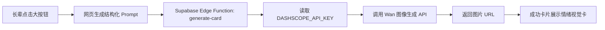

# 今日平安

一个给家人用的报平安网页原型。

## 现在已经实现

- 一个大按钮：`我今天平安`
- 首页文案支持动态联系人，例如 `妈妈` 给 `臭哄小榴莲` 报平安
- 点击后显示包含“时间 + 接收人 + 今日状态”的成功卡片
- 点击后出现烟花动画
- 支持接 Supabase，把每日确认记录同步到云端并跨设备读取
- 内置 Wan Prompt 工作台，朋友可以直接改关键词、风格和今日状态
- 展示最近 7 天记录
- 手机和电脑都可以直接打开

## 参赛作品定位

当前项目已升级为「报个平安 Skill」的 demo：把一句普通的“我今天平安”，转化成可编辑、可复用、可分享的家庭报平安视觉卡片工作流。

当前版本已经完成关键词编辑、Prompt 生成、成功卡片、分享文案和记录保存，并提供 Supabase Edge Function 调 Wan API 的代码骨架。Wan API Key 必须放在服务端环境变量里，不要暴露在 GitHub Pages 前端。

参赛说明文档见：

```text
docs/contest-submission.md
```

## 动态联系人

页面默认是 `妈妈` 给 `臭哄小榴莲` 报平安。也可以通过网址参数打开不同联系人版本：

```text
https://duriboo.github.io/peace-checkin-web/?sender=妈妈&receiver=臭哄小榴莲&family=home
```

支持的参数：

- `sender` 或 `from`：发送人
- `receiver` 或 `to`：接收人
- `family`：家庭标识，用来区分不同家庭或测试环境
- `status`：今日状态，例如 `已到家`
- `mood`：情绪关键词，例如 `放心、温暖、晚饭后`
- `style`：画面风格，例如 `国风水彩`

## 如何打开

直接用浏览器打开：

```text
index.html
```

也可以在本地启动一个静态服务：

```bash
npm run start
```

## 用 GitHub + Vercel 部署

推荐方式是先把这个目录作为独立仓库推到 GitHub，然后在 Vercel 网页里一键 Import。

1. 在 GitHub 新建一个私有仓库，例如 `peace-checkin-web`。
2. 本项目已配置好 `origin`，仓库创建后在本目录执行：

```bash
git push -u origin main
```

如果是从零开始配置远端，可以先执行：

```bash
git remote add origin git@github.com:<你的 GitHub 用户名>/peace-checkin-web.git
```

3. 打开 Vercel Dashboard，选择 `Add New...` -> `Project`。
4. 从 GitHub 列表里 Import `peace-checkin-web`。
5. Framework Preset 选择 `Other`，Build Command 留空，Output Directory 留空，然后点击 Deploy。

## 不用 Vercel：GitHub Pages 部署

如果 Vercel 注册不了，可以直接用 GitHub Pages 发布这个静态网页。

1. 打开仓库：`https://github.com/JCeasywin/peace-checkin-web`
2. 进入 `Settings` -> `Pages`。
3. 在 `Build and deployment` 里，`Source` 选择 `Deploy from a branch`。
4. `Branch` 选择 `main`，目录选择 `/ (root)`，然后点击 `Save`。
5. 等待 1-2 分钟，网页地址通常是：

```text
https://duriboo.github.io/peace-checkin-web/
```

## Supabase 云端同步

这个网页会优先使用 Supabase 保存每日记录；如果 `supabase-config.js` 里还没有填连接信息，会退回到本机演示模式。

1. 在 Supabase 创建一个项目。
2. 打开 Supabase SQL Editor，执行 `supabase-schema.sql` 里的 SQL。
3. 在 Supabase 项目里找到 `Project URL` 和 `anon public` key。
4. 打开 `supabase-config.js`，填入：

```js
window.PEACE_CHECKIN_CONFIG = {
  supabaseUrl: "你的 Project URL",
  supabaseAnonKey: "你的 anon public key",
  tableName: "peace_checkins",
  defaultSender: "妈妈",
  defaultReceiver: "臭哄小榴莲",
  defaultFamilyKey: "jiachen-family",
};
```

5. 提交并推送：

```bash
git add .
git commit -m "Configure Supabase"
git push
```

注意：`anon public` key 可以放在前端网页里，但当前 SQL 策略为了方便家庭使用，允许匿名读写这张表。不要在这里保存身份证号、手机号、病历等敏感信息。

## Wan API 调用方式

GitHub Pages 不能直接安全调用 Wan API，因为浏览器前端会暴露 API Key。推荐路径是：



项目里已经提供 Edge Function 示例：

```text
supabase/functions/generate-card/index.ts
```

配置步骤：

1. 安装并登录 Supabase CLI。
2. 创建 Supabase 项目并关联本地项目。
3. 设置 Wan / DashScope API Key：

```bash
supabase secrets set DASHSCOPE_API_KEY=你的APIKey
```

4. 部署函数：

```bash
supabase functions deploy generate-card
```

5. 前端会通过 `supabaseClient.functions.invoke("generate-card")` 调用后端函数。

## 字段说明

- `sender`：发送人，默认 `妈妈`
- `receiver`：接收人，默认 `臭哄小榴莲`
- `family`：家庭标识，用于区分不同家庭或测试环境
- `status`：今日状态，例如 `平安`、`已到家`
- `style`：画面风格，例如 `国风水彩`、`手写卡片`
- `mood`：情绪关键词，例如 `放心、温暖、晚饭后`
- `details`：画面补充，用于进一步控制构图、留白和文字氛围

## 商业场景

- 养老服务机构每日关怀卡：工作人员帮老人生成每日状态卡，发给家属。
- 社区服务通知：社区把“已上门探访”“物资已送达”等状态变成温暖通知卡。
- 亲子陪伴产品：孩子到家、上学、活动结束后生成安心卡。
- 宠物寄养日报：宠物店给主人生成“今天吃饭、散步、状态良好”的日报卡。
- 民宿/旅行安全确认：旅客抵达、入住、出发后生成安全确认卡。

## 目前限制

这是家庭自用的轻量版本。需要注意：

- 只有配置 Supabase 后，你爸手机上点了，你的电脑才会同步看到。
- 还没有每天定时提醒和漏报通知。
- 当前没有登录系统，拿到链接的人可以打开页面。

## 下一版建议

接入一个后端和通知：

- 简单访问密码：避免陌生人随手点开
- 飞书机器人：你爸点击后通知你
- 定时任务：晚上没点时提醒你
