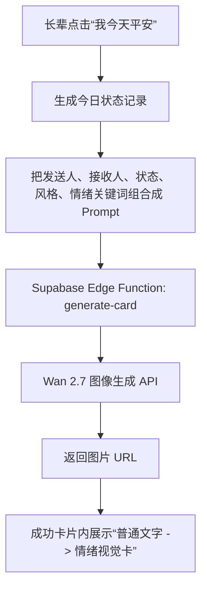

# 报个平安 Skill

## 作品简介

「报个平安 Skill」是一个面向家庭关怀场景的 Wan 视觉生成工作流。它把一句普通的“我今天平安”，转化成可复用、可编辑、可分享的中文视觉卡片，让家人不只收到一个冷冰冰的状态，而是收到一张带有时间、接收人、今日状态和情绪氛围的安心卡。

## 解决的问题 / 面向场景

很多家庭都会有“每天报平安”的需求，但普通消息容易被忽略，也缺少情绪表达。这个 Skill 面向以下场景：

- 独居老人每天给子女报平安
- 异地家人之间的轻量关怀
- 长辈不会复杂操作，只需要点一次按钮
- 子女希望跨设备看到每日确认记录
- 家庭成员想把每日状态生成成温暖的视觉记录

## 核心调用逻辑

```text
输入联系人、今日状态、情绪关键词、画面风格
-> 自动生成 Wan Prompt
-> Supabase Edge Function 读取服务端 DASHSCOPE_API_KEY
-> 调用 Wan 2.7 图像生成能力
-> 在报平安成功卡片里直接展示情绪视觉卡
-> 保存每日确认记录
-> 展示最近 7 天记录和可复制分享文案
```



## 输入字段

- 发送人：例如爸爸、妈妈、外婆
- 接收人：例如臭哄小榴莲、女儿、家人
- 今日状态：例如平安、已到家、今天一切都好
- 情绪关键词：例如放心、温暖、傍晚、家人
- 画面风格：手写卡片、国风水彩、家庭相册、手机通知卡、温暖插画
- 画面补充：对构图、留白、文字和氛围的补充要求

## 输出内容

- 成功卡片：时间、接收人、今日状态
- 前后对比：普通文字 -> 情绪视觉卡
- Wan Prompt：可复制、可复用、可继续调优
- 视觉卡片：优先展示 Wan API 生成图，未配置 API 时显示本地预览
- 分享文案：方便发给家人或发布演示内容
- 最近 7 天记录：体现真实使用场景中的持续性

## 使用到的 Wan 能力

计划使用 Wan 2.7 图像生成能力，把结构化家庭状态输入生成中文视觉卡片。后续可扩展到图生视频或文生视频能力，把 7 天报平安记录生成成一段家庭安心周报短片。

## 可复用性

这个作品不是一次性生成图，而是一个可复用 Skill：

- 长辈端是大按钮、少输入、自动生成，降低使用门槛
- 朋友可以直接在网页里改关键词，不需要改代码
- Prompt 自动根据联系人、状态、风格实时生成
- 同一套工作流可以复用到不同家庭成员
- Supabase 配置后可以跨设备读取每日确认记录
- 后续可以继续升级为微信小程序、飞书通知或定时提醒

## 商业潜力

这个 Skill 可以从家庭报平安扩展到多种“状态确认 + 情绪视觉化”场景：

- 养老服务机构每日关怀卡：护工或机构每天给家属发送老人状态卡。
- 社区服务通知：把社区探访、物资送达、活动提醒变成更友好的通知卡。
- 亲子陪伴产品：孩子到家、上学、活动结束后生成安心卡。
- 宠物寄养日报：宠物店给主人生成宠物状态日报卡。
- 民宿/旅行安全确认：旅客抵达、入住、出发后生成安全确认卡。

## 前后对比

生成前：

```text
妈妈 今天对 臭哄小榴莲 说：平安
```

生成后：

```text
一张带有日期、接收人、今日状态和温暖视觉氛围的家庭报平安卡片。
```

## 合规说明

- 不使用真实公众人物肖像
- 不使用第三方品牌 Logo
- 不生成医疗承诺、政治敏感、暴力或恐怖内容
- 输出内容应标注 AI 生成
- 当前版本不保存身份证号、手机号、病历等敏感信息

## 演示链接

网页演示：

```text
https://duriboo.github.io/peace-checkin-web/
```

GitHub 仓库：

```text
https://github.com/JCeasywin/peace-checkin-web
```

## 下一步升级

- 接入 Wan API 后端代理，真实生成视觉卡片
- 增加生成结果保存和历史图片展示
- 增加访问密码，避免公开页面被误用
- 增加飞书 / 微信提醒，形成完整家庭关怀闭环
